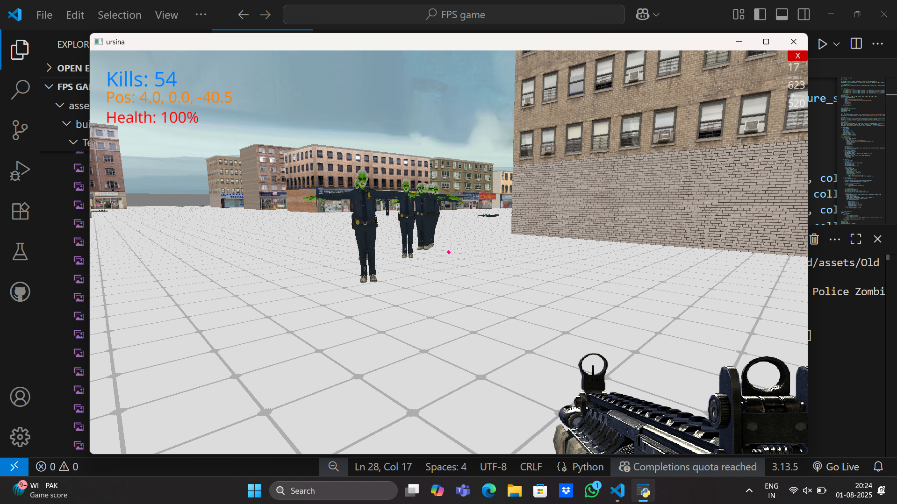
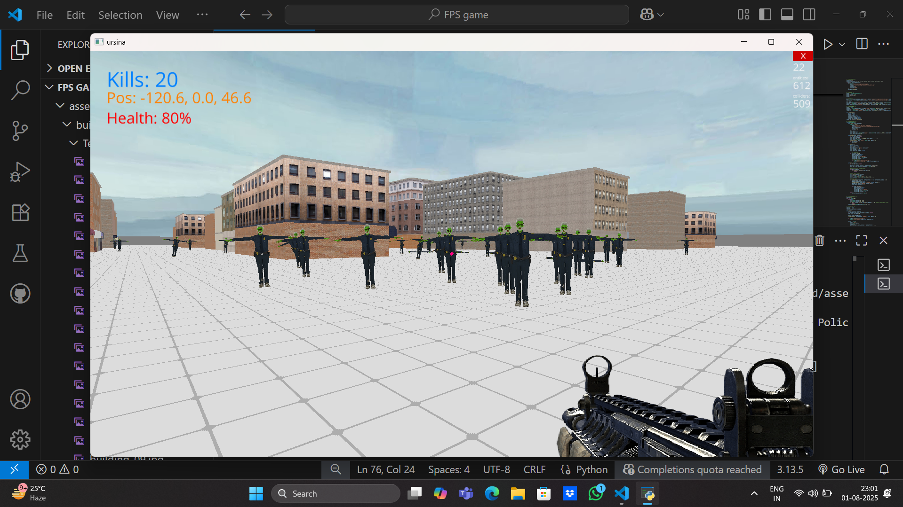

# FPS Zombie Survival Game 🧟‍♂️🔫

A 3D first-person zombie survival game built using the Ursina Engine in just **2.5 days**.

## 🚀 Features
- 3D FPS camera & controls
- 100 enemy zombies with AI: chase and attack
- Bullet collision detection
- Win/Lose system with custom message
- Buildings imported using `.glb` and `.obj` formats
- Health bar, kill counter, damage flash, muzzle flash
- Sound effects for gunfire and victory (`batman.mp3`)
- Pause/resume menu

## 📂 Assets
- Zombie model: free from [Sketchfab]
- Buildings: downloaded `.fbx` and converted to `.glb`
- Gun image, sound FX, and music: free public libraries

## 🎮 Controls
- `WASD` to move
- `Mouse` to aim
- `Left Click` to shoot
- `Esc` to pause/resume

## 🛠 Requirements
- Python 3.8+
- Ursina Engine

Install dependencies:
```bash
pip install ursina
```

## 📷 Screenshots





## 🙋‍♂️ Author

**Syed Mohammad Maaz**  
🎯 Mission: Build exciting games in record time  
📅 Built in just **2.5 days**


## 🔗 Connect with Me

- [LinkedIn](https://www.linkedin.com/in/maaz9764/)
